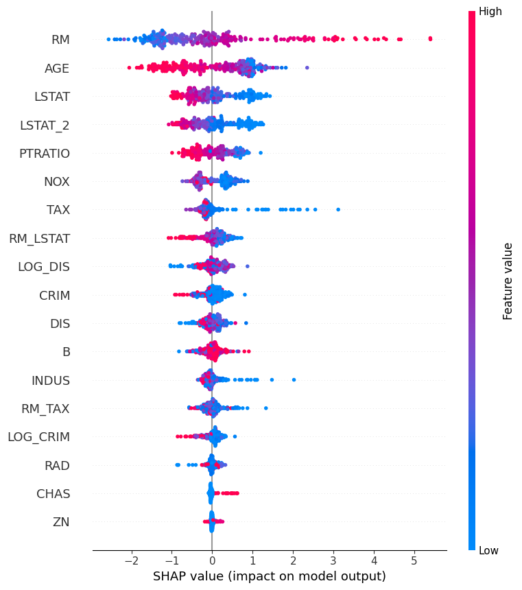

# Model Metrics
This document summarizes the evaluation metrics, validation strategy, and performance comparison of the models trained for the ValuAI project.

---

## 1. Objective
The goal of the model evaluation is to determine how well different algorithms predict house prices based on historical housing data. Metrics were selected to reflect both accuracy and stability.

---

## 2. Evaluation Metrics Used

📌 Regression Metrics
| Metric      | Description | Why it Matters |
| ----------- | ----------- | -------------- |
| R2          | Coefficient of Determination | Measures the proportion of variance in the dependent variable that is predictable from the independent variables. |
| MSE        | Mean Squared Error | Measures the average of the squares of the errors between the predicted and actual values. |

---

## 3. Validation Strategy

Train/Validation/Test Split
- Train: 70%
- Validation: 15%
- Test: 15%

---

## 4. Baseline Model
A simple baseline is used for comparison:
- Baseline: Predicts the mean house price
- Baseline metrics are recorded to check if ML models add value

---

## 5. Model Comparison

| Model | R2 | MSE |
| ----- | -- | ---- |
| Linear Regression | 0.62 | 6.39 |
| Lasso | 0.63 | 6.33 |
| Ridge | 0.63 | 6.18 |
| Random Forest | 0.69 | 5.12 |
| XGBoost | 0.75 | 4.09 |
| CatBoost | 0.76 | 4.04 |

---

## 6. Feature Importance / Explainability

### Techniques
- SHAP Values

### Sections
- Top 10 most important features:
- - RM
- - AGE
- - LSTAT
- - LSTAT_2
- - PTRATIO
- - NOX
- - TAX
- - RM_LSTAT
- - LOG_DIS
- - CRIM

---

## 7. Final Model Selection
- CatBoost Regressor
- Why it was chosen: Higher R2
- Hyperparameters used: depth=8, learning_rate=0.05, iterations=1000, verbose=0

---

## 8. Next Steps / Improvements
Suggested improvements:
- Hyperparameter tuning with Optuna / GridSearchCV
- Adding external data: schools, amenities, etc.

---